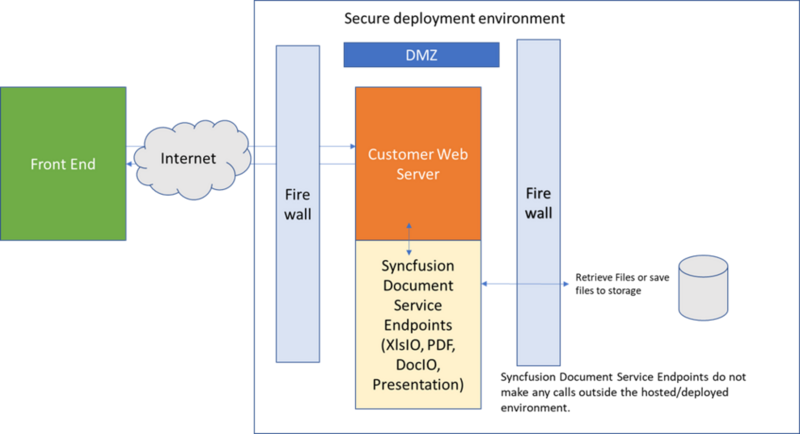

> With the 2025 Volume 1 release, we will discontinue support for .NET 6.0 and 7.0 in WinForms, WPF, WinUI, and Document Processing Libraries. Please plan to upgrade to .NET 8.0 or higher.

# Welcome to Syncfusion&reg; Document Processing Framework

Syncfusion&reg; Document Processing Framework is a collection of class libraries-including PDF, Word, Excel, PowerPoint, PDF Converter, Smart Data Extractor, and Markdown as part of the Document SDK, and the PDF Viewer SDK, DOCX Editor SDK, and Spreadsheet Editor SDK-that enable creating, editing, reading, and converting office (Word, Excel, PowerPoint) documents to PDF in .NET Framework, .NET Core, and UWP applications without Microsoft Office or Adobe dependencies. It streamlines development by providing ready-made tools for document handling, letting developers focus on their application’s core functionality.

## List of Document Processing Products:

<table>
<tr>
<th width="25%">
SDKs
</th>
<th width="75%">
Product Description
</th>
</tr>
<tr>
<td>
Document SDK
</td>
<td>
<ul>
<li><a href="https://help.syncfusion.com/document-processing/pdf/pdf-library/overview">PDF Library</a> is a class library used to create, read, and write PDF files and <a href="https://help.syncfusion.com/document-processing/pdf/conversions/overview">convert</a> office (Word, Excel, PowerPoint) to PDF in .NET Framework [Windows Forms, WPF, ASP.NET MVC], .NET Core, UWP, WinUI, .NET MAUI, JavaScript, Flutter, and Blazor applications.</li>
<li><a href="https://help.syncfusion.com/document-processing/word/word-library/overview">Word(DocIO) Library</a> is a class library used to create, read, edit, and <a href="https://help.syncfusion.com/document-processing/word/conversions/overview">convert</a> Microsoft Word files in .NET Framework [Windows Forms, WPF, ASP.NET MVC], .NET Core, UWP, WinUI, .NET MAUI, Java, and Blazor applications.</li>
<li><a href="https://help.syncfusion.com/document-processing/excel/excel-library/overview">Excel(XlsIO) Library</a> is a class library  used to create, read, edit, write, and <a href="https://help.syncfusion.com/document-processing/excel/conversions/overview">convert</a> Microsoft Excel files in .NET Framework [Windows Forms, WPF, ASP.NET MVC], .NET Core, UWP, WinUI, .NET MAUI, Flutter, and Blazor applications.</li>
<li><a href="https://help.syncfusion.com/document-processing/powerpoint/powerpoint-library/overview">PowerPoint Library</a> is a .NET class library used to create, read, edit, and <a href="https://help.syncfusion.com/document-processing/powerpoint/conversions/overview">convert</a> Microsoft PowerPoint (PPTX) files in .NET Framework [Windows Forms, WPF, ASP.NET MVC], .NET Core, UWP, WinUI, .NET MAUI, and Blazor applications.</li>
<li><a href="https://help.syncfusion.com/document-processing/pdf/conversions/overview">PDF Converter</a> is a .NET class library that converts several file formats such as HTML, Word, Excel, PowerPoint, Markdown, and images to PDF documents. It also supports conversion of PDF documents to images in .NET Framework [Windows Forms, WPF, ASP.NET MVC], .NET Core, WinUI, .NET MAUI, and Blazor applications.</li>
<li><a href="https://help.syncfusion.com/document-processing/data-extraction/overview">Smart Data Extraction Library</a> is a .NET class library used to extract structured and unstructured data (such as text, tables, form fields, and layout information) from various document formats including PDFs and scanned images. It also supports conversion of PDF documents to Markdown in .NET Framework [Windows Forms, WPF, ASP.NET MVC], .NET Core, WinUI, .NET MAUI, and Blazor applications.</li>
<li>The <a href="https://help.syncfusion.com/document-processing/data-extraction/net/ocr-processor/overview">OCR (Optical Character Recognition)</a> Processor extracts text from scanned PDF documents and images, making the content searchable and editable. It uses advanced image processing techniques to improve recognition accuracy and convert image-based content into reliable, machine-readable text.</li>
<li>Markdown Library is a .NET class library  used to create, read, edit, and convert Markdown files to other formats. It enables seamless Markdown processing in .NET Framework [Windows Forms, WPF, ASP.NET MVC], .NET Core, UWP, WinUI, .NET MAUI, and Blazor applications.</li>
</ul>
</td>
</tr>
<tr>
<td>
PDF Viewer SDK
</td>
<td>
The <a href="https://help.syncfusion.com/document-processing/pdf/pdf-viewer/overview">PDF Viewer</a> component designed for viewing, reviewing, and annotating PDF documents across web, desktop, and mobile applications. It offers advanced capabilities such as text search, form filling, and annotations for smooth and interactive PDF handling. The component can be easily integrated with platforms like ASP.NET Core, Blazor, JavaScript, Angular, React, WinForms, WPF, and various mobile frameworks, all without the need for external dependencies.
</td>
</tr>
<tr>
<td>
DOCX Editor SDK
</td>
<td>
The <a href="https://help.syncfusion.com/document-processing/word/word-processor/overview">DOCX Editor</a> is a Microsoft Word-like component for viewing, editing, and printing documents across WPF, JavaScript, Angular, React, Vue, ASP.NET MVC, ASP.NET Core, and Blazor applications-without requiring Microsoft Office. It offers rich features such as formatting, tables, images, track changes, and real-time collaboration, with easy integration so developers can focus on core application logic.
</td>
</tr>
<tr>
<td>
Spreadsheet Editor SDK
</td>
<td>
The <a href="https://help.syncfusion.com/document-processing/excel/spreadsheet/overview">Spreadsheet Editor</a> is a powerful, Excel‑like component for creating, viewing, editing, and formatting Microsoft Excel files directly within web applications. It offers a wide range of advanced features, including formulas, charts, sorting, filtering, data validation, and worksheet protection, enabling users to work with data efficiently. Designed for versatility, it supports integration across modern frameworks and platforms such as ASP.NET Core, Blazor, Angular, React, JavaScript, Vue, ASP.NET MVC, WinForms, WPF, and UWP, all without requiring external dependencies, making it a lightweight and flexible solution for delivering rich spreadsheet functionality.
</td>
</tr>
</table>

## AI-Driven Solutions

<table>
<tr>
<th width="25%">AI Solutions</th>
<th width="75%">Description</th>
</tr>

<tr>
<td>Agent Skills</td>
<td>
Ground your AI coding assistant (GitHub Copilot, Cursor, Claude, and others) in verified Syncfusion APIs - eliminating hallucinated methods. Install one with pre-built document and code skills and generate production-ready document code without leaving your IDE. It also allows executing document operations directly via CSX scripts.
  Learn more about:  
<ul>
<li><a href="https://help.syncfusion.com/document-processing/skills/document-sdk">Document SDK Skills</a></li>
<li><a href="https://help.syncfusion.com/document-processing/skills/pdf-viewer-sdk/component-skills">PDF Viewer SDK Skills</a></li>
<li><a href="https://help.syncfusion.com/document-processing/skills/docx-editor-sdk/component-skills">DOCX Editor SDK Skills</a></li>
<li><a href="https://help.syncfusion.com/document-processing/skills/spreadsheet-editor-sdk/component-skills">Spreadsheet Editor SDK Skills</a></li>
</ul>
</td>
</tr>

<tr>
<td>Agentic UI Builder </td>
<td>
Transforms natural-language prompts into production-ready UIs using real Syncfusion&reg; components. Generates structured, responsive layouts with maintainable architecture by default. Integrates with AI-powered IDEs to produce accurate code while following best practices, accessibility guidelines, and enterprise UI standards. Helps developers quickly move from idea to fully functional interfaces within their workflow.
  Learn more about:  
<ul>
<li><a href="https://help.syncfusion.com/document-processing/skills/pdf-viewer-sdk/ui-builder-skills">PDF Viewer UI Builder</a></li>
<li><a href="https://help.syncfusion.com/document-processing/skills/docx-editor-sdk/ui-builder-skills">DOCX Editor UI Builder</a></li>
<li><a href="https://help.syncfusion.com/document-processing/skills/spreadsheet-editor-sdk/ui-builder-skills">Spreadsheet UI Builder</a></li>
</ul>
</td>
</tr>

<tr>
<td>AI Agent Tools (Document SDK)</td>
<td>
Enables AI agents to autonomously execute document tasks at runtime - generate reports, convert files, and extract form data - without requiring manual processing logic. Integrate the <a href="https://www.nuget.org/packages/Syncfusion.DocumentSDK.AI.AgentTools">Syncfusion.DocumentSDK.AIAgentTools</a> NuGet package to extend your agent’s document processing capabilities.
  Learn more about <a href="https://help.syncfusion.com/document-processing/ai-agent-tools/overview">AI Agent Tools</a>.
</td>
</tr>

<tr>
<td>AI Coding Assistant (MCP Server)</td>
<td>
Integrates with Visual Studio, VS Code, and JetBrains Rider through MCP Server. Describe your document processing requirement and receive documentation-backed, production-ready C# code instantly.
  Learn more about <a href="https://help.syncfusion.com/document-processing/mcp-server/ai-coding-assistant/overview">AI Coding Assistant</a>.
</td>
</tr>

</table>

## Web APIs

The [Syncfusion Document Processing API](https://hub.docker.com/r/syncfusion/document-processing-apis) is now available as a Docker-based solution, enabling developers to quickly deploy web services for document conversion, data extraction, and file manipulation. A ready-to-deploy Docker image for creating document processing Web APIs provides a streamlined and standardized approach, allowing rapid setup and deployment of these services. 

Learn more about [Web APIs](https://help.syncfusion.com/document-processing/web-apis/overview).

## How to best read this user guide

* **Getting Started** - The best way to get started would be to read the “Getting Started” section for the component you would like to begin with. The “Getting Started” and “NuGet Packages required” sections give enough information, so it is recommended to read these sections end-to-end before starting to write code. All other information can be referred as needed. 
* **Demo** - After learning the basics about the component, integrate the component into your application. A good starting point is to refer to the code examples in the sample browser and in this user guide. You will likely find a code example that resembles your intended usage scenario. 
* **API Reference** - Another valuable resource is available in the [API reference](https://help.syncfusion.com/cr/document-processing) that provides detailed information on the object hierarchy as well as the settings available on every object.

## Additional help resources

The [Knowledge Base](https://support.syncfusion.com/kb) section contains responses to common questions asked by customers. This would be a good place to search for the topics that are not covered in the User Guide.

Similar to the Knowledge Base, the [Forum](https://www.syncfusion.com/forums/) section also contains responses to questions by other customers.

## Create a support incident

If you are unable to find the information you are looking for in the self-help resources mentioned above, please contact us by creating a [support ticket](https://www.syncfusion.com/support/directtrac/incidents).

## Document Processing Security Information

Syncfusion&reg; products are used in some of the most sensitive applications. We must be concerned about security.

We prioritized security when developing our products. Each control is self-contained and does not require an outside server or Syncfusion&reg; API. Our products exist as defined by the developer and only execute the commands defined by the developer. We built them to work with any security paradigms that our customers can utilize.

Our customers cannot use any hosted Web APIs provided by Syncfusion.  We provide the necessary libraries and code examples for our customers to build their own APIs by allowing them to customize the functionality and manage their own security. Additionally, these APIs can be packaged and deployed using [Docker images](https://hub.docker.com/r/syncfusion/document-processing-apis) for easier setup and consistent deployment across different environments.

	
## See also

- [PDF Library](https://help.syncfusion.com/document-processing/pdf/overview)
- [Word Library](https://help.syncfusion.com/document-processing/word/overview)
- [Excel Library](https://help.syncfusion.com/document-processing/excel/overview)
- [PowerPoint Library](https://help.syncfusion.com/document-processing/powerpoint/overview)
- [Data Extraction](https://help.syncfusion.com/document-processing/data-extraction/overview)
